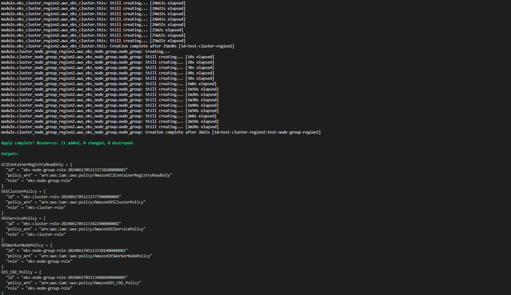
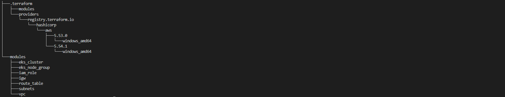

# Create Multi Region EKS Deployment Using Terraform

## Modules
- IAM Role 
- VPC
- Subnet
- Internet Gateway
- Route Table
- EKS Cluster
- EKS Node Group

## Command in Terminal

```bash
terraform init
terraform validate
terraform fmt
terraform plan
terraform apply -auto-approve
terraform destroy -auto-approve

```

# Screenshots



